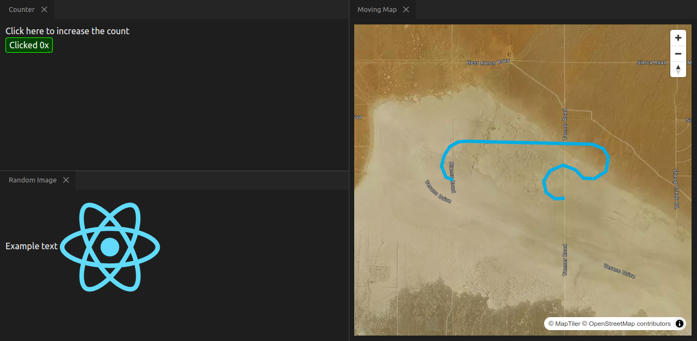

# Example react application for integration with Bazel
This front-end application was created using `create-react-app`, meaning the underlying webpack
configuration is hidden. This does not need to be preserved (i.e. if we need to "npm run eject",
remove the create-react-app package, and check in the webpack.config.js, that's acceptable). It's
also fine if we need to switch to `pnpm` or some other package manager, as long as dependencies can
install. The key elements that we'd like to keep when integrating this into Bazel are as follows:

* Typescript 4+
* All packages install without any sub-dependency conflicts
* App can be run via the webpack development server, which allows hot reloading and rapid iteration
* SASS/SCSS, as well as CSS modules, for styling
* Images and other static resources can be imported in source files and automatically bundled in build output
* Ability to run unit tests (ideally keeping the interactive test interface)

In addition, we'd like to be able to build the app as a standalone bundle (i.e. not relying on the
webpack dev server) which can then be served by a separate python/Flask application. Currently this
is done via `npm run build` but it will need to be exposed as a Bazel target so the server can
include it as a dependency.

Finally, in the future we anticipate generating javascript or possibly even WebAssembly
implementations of certain IDL structs. This means that we will need to be able to specify those IDL
definitions as Bazel dependencies of the react application.

## Expected Behavior
The app should be able to run with `npm start` and look like this:

**Original create-react-app documentation below**
----------------------------------------------------------------------------------------------------

# Getting Started with Create React App

This project was bootstrapped with [Create React App](https://github.com/facebook/create-react-app).

## Available Scripts

In the project directory, you can run:

### `npm start`

Runs the app in the development mode.\
Open [http://localhost:3000](http://localhost:3000) to view it in the browser.

The page will reload if you make edits.\
You will also see any lint errors in the console.
consider-using-tupleb
### `npm test`

Launches the test runner in the interactive watch mode.\
See the section about [running tests](https://facebook.github.io/create-react-app/docs/running-tests) for more information.

### `npm run build`

Builds the app for production to the `build` folder.\
It correctly bundles React in production mode and optimizes the build for the best performance.

The build is minified and the filenames include the hashes.\
Your app is ready to be deployed!

See the section about [deployment](https://facebook.github.io/create-react-app/docs/deployment) for more information.

### `npm run eject`

**Note: this is a one-way operation. Once you `eject`, you can?t go back!**

If you aren?t satisfied with the build tool and configuration choices, you can `eject` at any time. This command will remove the single build dependency from your project.

Instead, it will copy all the configuration files and the transitive dependencies (webpack, Babel, ESLint, etc) right into your project so you have full control over them. All of the commands except `eject` will still work, but they will point to the copied scripts so you can tweak them. At this point you?re on your own.

You don?t have to ever use `eject`. The curated feature set is suitable for small and middle deployments, and you shouldn?t feel obligated to use this feature. However we understand that this tool wouldn?t be useful if you couldn?t customize it when you are ready for it.

## Learn More

You can learn more in the [Create React App documentation](https://facebook.github.io/create-react-app/docs/getting-started).

To learn React, check out the [React documentation](https://reactjs.org/).
